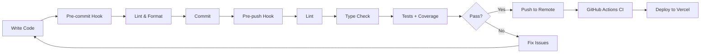

# Testing and CI/CD Setup

## 🧪 Testing Infrastructure

This project has a comprehensive testing setup to ensure code quality and reliability.

### Test Coverage Requirements

The project enforces the following minimum coverage thresholds:
- **Statements**: 70%
- **Branches**: 60%
- **Functions**: 60%
- **Lines**: 70%

### Running Tests

```bash
# Run all tests
npm test

# Run tests in watch mode
npm run test:watch

# Run tests with coverage report
npm run test:coverage

# Run full validation (lint + type-check + tests)
npm run validate
```

## 🪝 Git Hooks

The project uses Husky for Git hooks to ensure code quality:

### Pre-commit Hook
- Runs ESLint on staged files
- Formats code with Prettier
- Automatically fixes issues when possible

### Pre-push Hook
**MANDATORY** - Runs before every push:
1. **ESLint** - Checks for code quality issues
2. **TypeScript** - Type checking
3. **Tests with Coverage** - Runs full test suite and shows coverage report

If any check fails, the push will be blocked.

## 📊 Current Test Coverage Status

```
Statements   : 60.81% ( 1251/2057 )
Branches     : 53.75% ( 516/960 )
Functions    : 49.8% ( 256/514 )
Lines        : 61.91% ( 1182/1909 )
```

⚠️ **Note**: Some tests are currently failing and need to be fixed to meet coverage thresholds.

## 🚀 CI/CD Pipeline

GitHub Actions workflow runs on:
- Push to `main` or `develop` branches
- Pull requests to `main`

### Pipeline Steps:
1. **Checkout code**
2. **Setup Node.js** (Matrix: 18.x, 20.x)
3. **Install dependencies**
4. **Run ESLint**
5. **Run TypeScript type checking**
6. **Run tests with coverage**
7. **Upload coverage to Codecov**
8. **Build application**
9. **Deploy to Vercel** (only on main branch)

## 📝 Testing Best Practices

1. **Always run tests before pushing**: The pre-push hook enforces this
2. **Write tests for new features**: Maintain or improve coverage
3. **Fix failing tests promptly**: Don't push with failing tests
4. **Review coverage reports**: Focus on critical paths

## 🛠️ Troubleshooting

### Bypass hooks (emergency only):
```bash
# Skip pre-commit hook
git commit --no-verify -m "message"

# Skip pre-push hook
git push --no-verify
```

⚠️ **Warning**: Only bypass hooks in emergencies. Always fix issues promptly.

### Fix test issues:
```bash
# Update snapshots if needed
npm test -- -u

# Run specific test file
npm test -- path/to/test.tsx

# Debug with coverage
npm run test:coverage -- --verbose
```

## 📈 Improving Coverage

Priority areas for test improvements:
1. Fix failing TaskCard tests (undefined labels issue)
2. Improve TaskContext coverage (currently 49.8% functions)
3. Add more integration tests
4. Cover edge cases in components

## 🔄 Workflow Summary



---

**Remember**: Quality over speed. The testing infrastructure is here to help maintain high code standards.